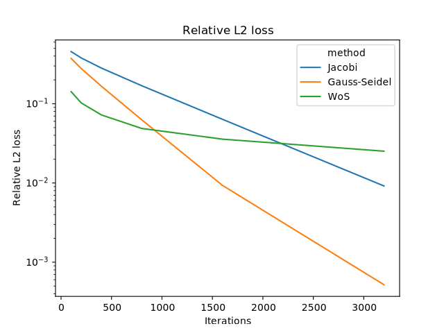

# 10-708 Project

Source code for "Diffusing PDE solutions from thermodynamic
equilibrium", a course project of [10-708 Probabilistic
Graphical Models](https://andrejristeski.github.io/10708S24/).

## Requirements

- jax
- seaborn
- pycairo (optional, to generate PDFs)

## Running

```console
python monte_carlo.py
```

```console
python main.py
```

## Experimental results



