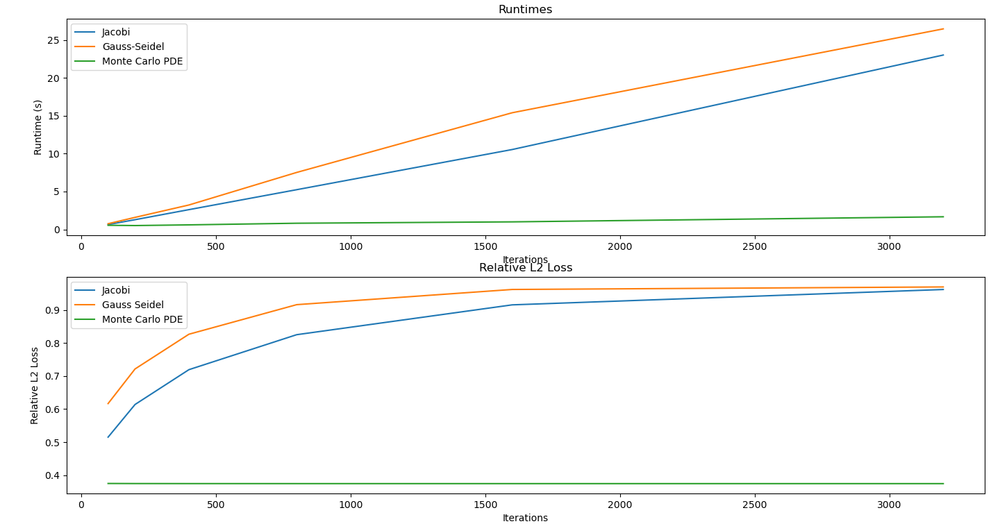

# 10-708 Project

Source code for "Diffusing PDE solutions from thermodynamic
equilibrium", a course project of [10-708 Probabilistic
Graphical Models](https://andrejristeski.github.io/10708S24/).

## Requirements

- numpy
- matplotlib
- pycairo (optional, to generate PDFs)

## Running

```console
python monte_carlo.py
python main.py
```

```text
Gauss Seidel took 45.439414978027344 seconds to run 5000 iterations
Jacobi took 0.909848690032959 seconds to run 100 iterations with relative L2 loss 0.4689865228740145
Jacobi took 1.816960096359253 seconds to run 200 iterations with relative L2 loss 0.38668201465429164
Jacobi took 3.678007125854492 seconds to run 400 iterations with relative L2 loss 0.2847314155363017
Jacobi took 7.351972341537476 seconds to run 800 iterations with relative L2 loss 0.16848626574206355
Jacobi took 14.596973657608032 seconds to run 1600 iterations with relative L2 loss 0.0630300430034079
Jacobi took 29.16117525100708 seconds to run 3200 iterations with relative L2 loss 0.009075531690407347
Gauss Seidel took 0.8999433517456055 seconds to run 100 iterations with relative L2 loss 0.38201495536457614
Gauss Seidel took 1.8013989925384521 seconds to run 200 iterations with relative L2 loss 0.28103539767446584
Gauss Seidel took 3.689483880996704 seconds to run 400 iterations with relative L2 loss 0.16608262167478388
Gauss Seidel took 7.367677211761475 seconds to run 800 iterations with relative L2 loss 0.06210993886738911
Gauss Seidel took 14.790256977081299 seconds to run 1600 iterations with relative L2 loss 0.009225532404629309
Gauss Seidel took 29.46507501602173 seconds to run 3200 iterations with relative L2 loss 0.0005146916241590045
```

## Experimental results


