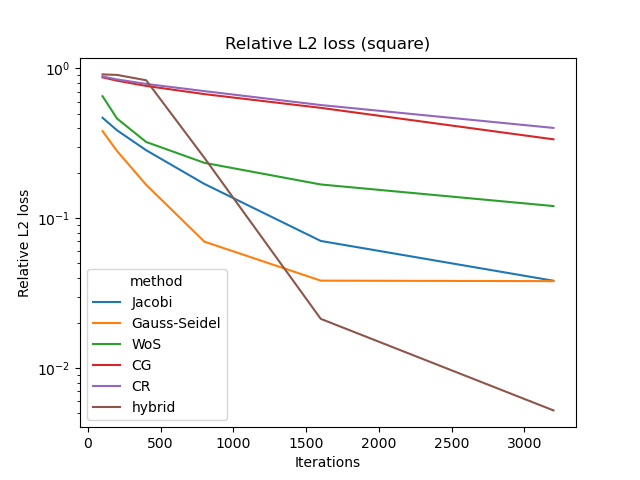
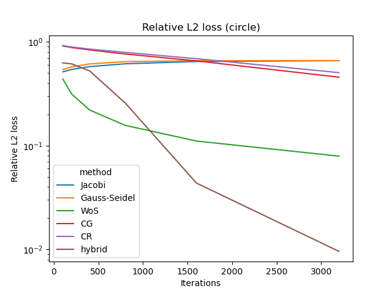
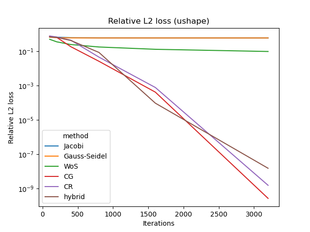

# 10-708 Project

Source code for "Diffusing PDE solutions from thermodynamic
equilibrium", a course project of [10-708 Probabilistic
Graphical Models](https://andrejristeski.github.io/10708S24/).

## Requirements

- fenics
- jax
- mshr
- numpy
- scipy
- seaborn
- shapely
- torch

See `environment.yml` for a conda environment.

## Running

```console
python main.py
```

## Experimental results

Square geometry



Circle geometry



"U-shape" geometry


